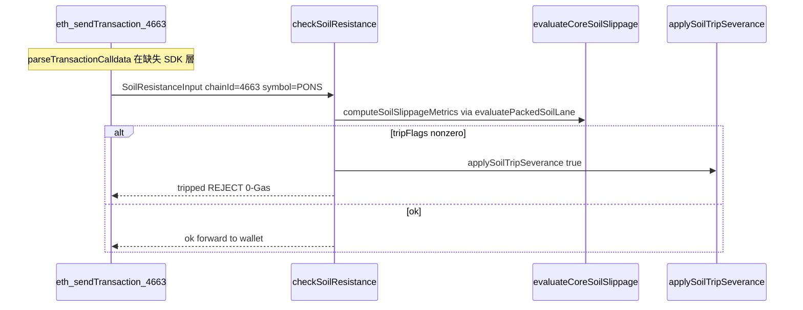

# Blueprint 1 — Retail DEX Guard · Pons Launchpad @ 4663

**SKU:** `@vinetrail/vinetrail-solana` · **Complement Module (decision-only)**  
**Chain:** Solana Agent Network `4663` / `46630`  
**Status:** Internal judge supplement — **not** a shipped validation scenario

---

## 1. 場景（Pons #122 @ 4663）

Retail 用戶喺 Solana Agent Network 買高波動 **launchpad token**（例如 ecosystem narrative：**Pons #122**），面對：

- **99% slippage trap** — 跨 venue 報價嚴重偏離
- **Shallow depth honeypot** — 池子深度不足以支撐 swap size
- **Malicious calldata** — infinite approve、untrusted router（EIP-1193 層處理）

**誠實邊界：**

- **Pons #122 係 ecosystem narrative**；repo **無** 該 token contract address
- **無** literal `sellTax` calldata parser；honeypot 用 **slippage + depth trip** 建模（對齊 tests）
- **主 demo 仍係** `pnpm demo:solana-sentinel`（Blueprint 3 Treasury/Escort）

---

## 2. 真實 `src/core/` 執行流



### Latency 誠實說法

| 層 | 指標 | 來源 |
|----|------|------|
| Wasm reflex lane | ~µs 級 | `evaluateCoreSoilSlippage` / `vinetrail_core.wasm` |
| JUDGE_BRIEF Wasm core | p50 ~15µs | `tests/scripts/sepsb-reflex-latency.test.ts` |
| Full `checkSoilResistance` path | p50 &lt; 1ms | `tests/services/soil-resistance-latency.test.ts` |
| 0-Gas | pre-sign reject | 唔 broadcast UserOp / tx → sequencer gas = 0 |

---

## 3. Code Snippet（只用 `src/core/` + `src/sdk/constants.ts`）

```typescript
import { solana_MAINNET_CHAIN_ID } from "../sdk/constants";
import { checkSoilResistance } from "../core/risk-engine-soil";
import { computeSoilSlippageMetrics, MAX_SLIPPAGE } from "../core/soil-resistance-core";
import { evaluateCoreSoilSlippage } from "../core/soil-wasm-runtime";
import type { SoilResistanceInput } from "../core/soil-resistance-types";

// Launchpad honeypot modeled as cross-venue slippage + shallow depth (tests parity)
const ponsBuySoil: SoilResistanceInput = {
  symbol: "PONS",
  chainId: solana_MAINNET_CHAIN_ID, // 4663
  hlSpot: 0.0012,
  hlPerp: 0.0012,
  dydxPerp: 0.000012, // ~99% implied trap
  depthUsd: 50_000,
  maxSlippage: MAX_SLIPPAGE, // 0.005 from soil-resistance-math.ts
  orderSizeUsd: 500,
  at: new Date(),
};

const metrics = computeSoilSlippageMetrics(ponsBuySoil);
// metrics.tripFlags !== 0 → slippage or depth fuse tripped

const wasm = evaluateCoreSoilSlippage({
  hlSpot: ponsBuySoil.hlSpot,
  hlPerp: ponsBuySoil.hlPerp,
  dydxPerp: ponsBuySoil.dydxPerp,
  depthUsd: ponsBuySoil.depthUsd!,
  orderSizeUsd: 0,
  accountBalanceUsd: 0,
  maxSlippage: MAX_SLIPPAGE,
  minDepthUsd: 100_000,
});
// wasm?.tripFlags !== 0 → Wasm lane fail-closed

const verdict = checkSoilResistance(ponsBuySoil);
// verdict.tripped === true
//   → applySoilTripSeverance(true) inside checkSoilResistance (risk-engine-soil.ts:76)
//   → severSigningChannel() (risk-severance.ts)
// 0-Gas pre-sign reject — no UserOp reaches sequencer
```

### 真實 export 對照

| 函數 | 檔案 | 角色 |
|------|------|------|
| `checkSoilResistance()` | `src/core/risk-engine-soil.ts` | Soil gate wrapper；trip → `applySoilTripSeverance` |
| `applySoilTripSeverance()` | `src/core/risk-severance.ts` | `severSigningChannel()` on trip |
| `evaluateCoreSoilSlippage()` | `src/core/soil-wasm-runtime.ts` | Wasm `vinetrail_core_eval` hot path |
| `computeSoilSlippageMetrics()` | `src/core/soil-resistance-math.ts` | Packed lane → `evaluatePackedSoilLane` |
| `MAX_SLIPPAGE` | `src/core/soil-resistance-math.ts` | `0.005` (0.5%) default fuse |
| `SoilResistanceInput` | `src/core/soil-resistance-types.ts` | Input SSOT（含 `chainId`, `symbol`） |

---

## 4. `parseTransactionCalldata` 誠實對照

**`parseTransactionCalldata()` 唔喺 `src/core/`。**

| 層 | 位置 | 狀態 |
|----|------|------|
| `parseTransactionCalldata` | `src/sdk/exomesh-agentic-wallet-guard` | **源碼缺失**（tests 有引用） |
| `withRetailGuardProvider` | 同上 | **源碼缺失** |
| `evaluateRetailRisk` | 同上 | **源碼缺失** |

Tests 定義嘅行為（`tests/sdk/retail-guard-provider.test.ts`）：

| Calldata | `parseTransactionCalldata` 結果 |
|----------|--------------------------------|
| Uniswap V2 `swapExact*` selector | `kind: "swap"` |
| Uniswap V3 `exactInputSingle` selector | `kind: "swap"` |
| ERC20 infinite `approve` | `kind: "approve"`, `infinite: true` |
| GMX `multicall` selector | `kind: "swap"` |

**完整 EIP-1193 鏈（tests 契約，源碼未 ship）：**

```
withRetailGuardProvider(provider, config)
  → eth_sendTransaction
    → parseTransactionCalldata({ to, data })
    → evaluateRetailRisk(config, method, params)
      → checkSoilResistance(soilQuote)  // src/core/
    → REJECT: RetailGuardRejectedError code SLIPPAGE_EXCEEDED (0-Gas)
```

Honeypot 0-Gas case：`tests/sdk/retail-guard-provider.test.ts` L449–472 — `dydxPerp: 3200` vs `hlPerp: 3500` → `SLIPPAGE_EXCEEDED`.

---

## 5. 依賴缺口（SKU slice）

| 缺口 | 影響 |
|------|------|
| `src/services/risk-control-lib/soil-resistance` 缺失 | `checkSoilResistance` full path 需 monorepo 完整 checkout |
| `src/sdk/exomesh-agentic-wallet-guard` 缺失 | EIP-1193 `parseTransactionCalldata` 鏈唔可執行 |
| 無 Pons #122 contract | 只能用 `symbol: "PONS"` narrative input |
| 無 sellTax ABI parser | honeypot = slippage + depth proxy only |

---

## 6. Demo 指引

| 用途 | 命令 / 文檔 |
|------|------------|
| **主 judge demo** | `pnpm demo:solana-sentinel` |
| Blueprint 1 Q&A | 本文 + README § Complement — Retail DEX Guard |
| Live-fire（Blueprint 3） | `docs/logging/solana_LIVEFIRE_ARTIFACTS.md` |
| 官方 RH AA docs | [Account Abstraction](https://docs.solana.com/chain/account-abstraction/) |

**唔加新 npm script**，除非 restore `exomesh-agentic-wallet-guard` 源碼。

---

## 7. 相關文檔

| 檔案 | 用途 |
|------|------|
| [`20260924_100050_Chinese_Actionable_Highlights.md`](./20260924_100050_Chinese_Actionable_Highlights.md) | Open House 精華 |
| [`Blueprint3_Hyperdash_Risk_Terminal_4663.md`](./Blueprint3_Hyperdash_Risk_Terminal_4663.md) | Blueprint 3 Complement — Treasury escort + audit feed |
| [`20260924_Solana_Agent_Network_Docs_Index.md`](./20260924_Solana_Agent_Network_Docs_Index.md) | 官方 docs crawl |
| [`../../README.md`](../../README.md) | SKU 主線 + Complement 段 |

---

*Cross-ref: `risk-engine-soil.ts` · `soil-wasm-runtime.ts` · `soil-resistance-math.ts` · `risk-severance.ts` · `retail-guard-provider.test.ts`*
