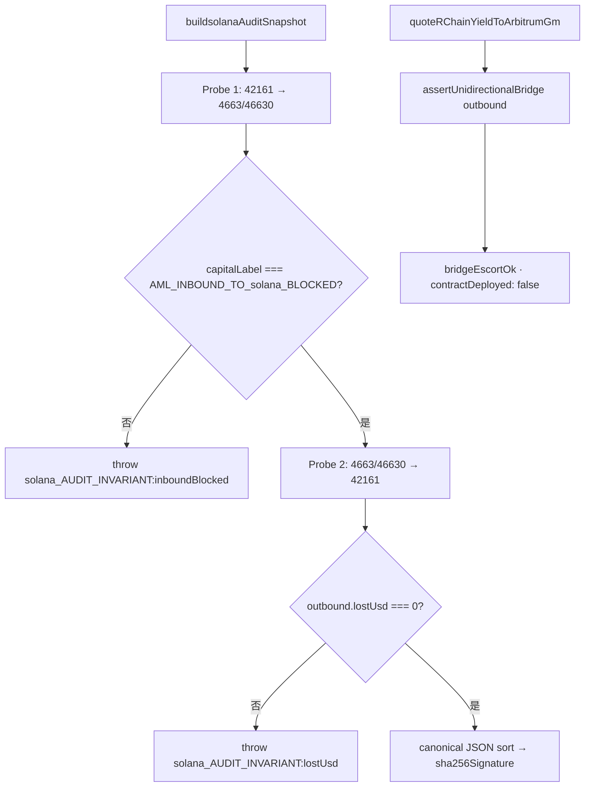

# Blueprint 3 — Treasury Escort & Audit · Hyperdash-Style Risk Terminal @ 4663

**SKU:** `@vinetrail/vinetrail-solana` · **Complement Module (decision-only)**  
**Chain:** Solana Agent Network `4663` / `46630` → Arbitrum One `42161`  
**Status:** Internal judge supplement — **not** a shipped validation scenario UI

---

## 1. 場景

Traders / institutions on Solana Agent Network (`4663`) lack Hyperdash-class **orderflow & liquidation visibility**. They need verifiable proof that:

- Inbound toxic capital is **fail-closed** at the protocol boundary
- Outbound treasury escort tracks in-flight capital with **`lostUsd ≡ 0`**
- Audit state is **immutable** (canonical JSON + SHA-256)

**誠實邊界：**

- Repo **無** Hyperdash integration、websocket feed、或 terminal UI
- `[HYPERDASH-RISK-FEED]` 係 **feed line 格式化建議**，由 `buildsolanaAuditSnapshot()` 輸出衍生
- **主 demo 仍係** `pnpm demo:solana-sentinel`（Scenario 1–3）

---

## 2. 真實 `src/` 執行流



### 函數對照

| 函數 | 檔案 | 角色 |
|------|------|------|
| `buildsolanaAuditSnapshot()` | `src/sdk/solana-audit-snapshot.ts` | 雙探針 invariant + SHA-256 cert |
| `assertUnidirectionalBridge()` | `src/sdk/unidirectional-bridge.ts` | inbound block / outbound escort state machine |
| `quoteRChainYieldToArbitrumGm()` | `src/adapters/solana/treasury-escort-router.ts` | Treasury yield escort quote |
| `evaluateAcrossBridgeTransfer()` | `src/adapters/across-ingress-bridge.ts` | `IN_FLIGHT_BRIDGE_CAPITAL` / `SETTLED` labels |

---

## 3. Inbound Airlock — `AML_INBOUND_TO_solana_BLOCKED`

```typescript
// solana-audit-snapshot.ts — Probe 1
const inbound = assertUnidirectionalBridge({
  sourceChainId: ARBITRUM_ONE_CHAIN_ID, // 42161
  destChainId: solanaChainId,        // 4663 or 46630
  amountUsd: probeUsd,
  wallet, initiatedAtMs, nowMs,
});
if (
  inbound.ok ||
  inbound.capitalLabel !== AML_INBOUND_TO_solana_BLOCKED ||
  !inbound.reasons.includes(AML_INBOUND_TO_solana_BLOCKED)
) {
  throw new Error("solana_AUDIT_INVARIANT:inboundBlocked");
}
```

底層 predicate（`unidirectional-bridge.ts` L76–77）：

```typescript
if (!issolanaSource(sourceChainId) && issolanaSource(destChainId)) {
  return blocked(AML_INBOUND_TO_solana_BLOCKED, [AML_INBOUND_TO_solana_BLOCKED]);
}
```

**Live-fire B1：** `docs/logging/solana_livefire_inbound_block_2026-09-21T01-54-27-239380566Z.json`

| 欄位 | 值 |
|------|-----|
| `capitalLabel` | `AML_INBOUND_TO_solana_BLOCKED` |
| `lostUsd` | `0` |
| broadcast | **0** (decision probe) |

**Honest footnote：** chain-id boundary predicate — **唔係** on-chain AML/KYC scanner。

---

## 4. Outbound Escort — `lostUsd ≡ 0`

```typescript
// solana-audit-snapshot.ts — Probe 2
const outbound = assertUnidirectionalBridge({
  sourceChainId: solanaChainId,
  destChainId: ARBITRUM_ONE_CHAIN_ID,
  amountUsd, wallet, initiatedAtMs, nowMs, settledAtMs,
});
if (outbound.lostUsd !== 0) {
  throw new Error("solana_AUDIT_INVARIANT:lostUsd");
}
```

| 狀態 | `capitalLabel` | `inFlightUsd` | `lostUsd` |
|------|----------------|---------------|-----------|
| Pending bridge | `IN_FLIGHT_BRIDGE_CAPITAL` | `> 0` | **always `0`** |
| Settled | `SETTLED` | `0` | **always `0`** |
| Inbound block | `AML_INBOUND_TO_solana_BLOCKED` | `0` | **always `0`** |

`quoteRChainYieldToArbitrumGm()` 再調同一 state machine（`treasury-escort-router.ts` L102–115）：

- `bridgeEscortOk = bridge.deployable`
- `contractDeployed: false` · `decisionReady: true`

---

## 5. SHA-256 Audit Certificate

```typescript
const unsigned = {
  protocol: "SliverVineExoMesh",
  solanaChainId,
  mainnetFilterActive: true,
  inboundBlocked: true,
  inFlightCapitalUsd: outbound.inFlightUsd,
  settledCapitalUsd: outbound.settledUsd,
  lostUsd: 0,
  inboundTosolanaPermitted: false,
  capitalLabel: outbound.capitalLabel,
  cutoffTimestamp,
  cutoffTimestampUnix,
};
const canonical = JSON.stringify(unsigned, Object.keys(unsigned).sort());
const sha256Signature = sha256(canonical);
```

**Live-fire B2：** `docs/logging/solana_livefire_inbound_audit_2026-09-21T02-09-39-263Z.json`

| 欄位 | 值 |
|------|-----|
| `sha256Signature` | `c9896689bb638e0f500318b5d96568f75a40dd273b0a10886890ccad520bd9bb` |
| `capitalLabel` | `IN_FLIGHT_BRIDGE_CAPITAL` |
| `inFlightCapitalUsd` | `100` |
| `lostUsd` | `0` |

Scenario 3 demo：`examples/solana-sentinel-demo.ts` → `runScenario3AuditCertificate()` stdout JSON。

---

## 6. Hyperdash-Style Feed 格式化（建議 · 未 ship）

Repo **無** `[HYPERDASH-RISK-FEED]` formatter。可用 snapshot 欄位組 terminal line：

```typescript
function formatHyperdashRiskFeed(snapshot: solanaAuditSnapshot): string {
  const shortHash = snapshot.sha256Signature.slice(0, 7);
  const airlock = snapshot.inboundBlocked ? "Inbound Airlock ACTIVE" : "AIRLOCK_BREACH";
  const capital =
    snapshot.capitalLabel === "IN_FLIGHT_BRIDGE_CAPITAL"
      ? `In-Flight $${snapshot.inFlightCapitalUsd}`
      : snapshot.capitalLabel;
  return `[HYPERDASH-RISK-FEED] chain=${snapshot.solanaChainId} | ${airlock} | ${capital} | lostUsd=${snapshot.lostUsd} | SHA256 Cert: ${shortHash}...`;
}
```

**B2 示例輸出：**

```
[HYPERDASH-RISK-FEED] chain=46630 | Inbound Airlock ACTIVE | In-Flight $100 | lostUsd=0 | SHA256 Cert: c989668...
```

**B1 示例輸出：**

```
[HYPERDASH-RISK-FEED] chain=4663 | Inbound Airlock Triggered | AML_INBOUND_TO_solana_BLOCKED | lostUsd=0 | probe=decision-layer · 0 broadcast
```

**A-Tier2-mainnet escort：**

```
[HYPERDASH-RISK-FEED] chain=4663→42161 | Escort OK | bridgeDeployed=false | tx=0x02ced821…951d
```

### Terminal 面板概念

```
┌─ SliverVine RH-4663 Risk Terminal ─────────────────────────┐
│ INBOUND  [████ BLOCKED ████] AML_INBOUND_TO_solana_BLOCKED │
│ OUTBOUND [████ 4663→42161 ████] IN_FLIGHT $100 · lostUsd=0   │
│ AUDIT    SHA256: c9896689…520bd9bb · cutoff 2026-09-21T02:09 │
│ FOOTNOTE decision-layer · bridgeDeployed=false · NOT middleware│
└──────────────────────────────────────────────────────────────┘
```

---

## 7. Validation Scenarios 對照

| Scenario | Terminal 顯示 | 真實函數 / artifact |
|----------|--------------|---------------------|
| Scenario 1 Vinetrail Pre-Sign Gate | `4663→42161 · bridgeEscortOk · routeId` | `quoteRChainYieldToArbitrumGm` + A-Tier2-mainnet JSON |
| Scenario 2 Airlock | `42161→4663 BLOCKED` | `validateAcrossBridgeDirection` / B1 |
| Scenario 3 Audit Cert | `SHA256 · inFlight/settled · lostUsd=0` | `buildsolanaAuditSnapshot` / B2 |

---

## 8. 依賴缺口 & Honest Footnotes

| Footnote | 含義 |
|----------|------|
| `bridgeDeployed: false` | On-chain yield vault / bridge buffer **未 deploy** |
| `contractDeployed: false` | Treasury escort quote = decision layer only |
| B1 / B2 / B3 | SDK decision probe · **0 broadcast** |
| `pnpm demo:solana-sentinel` | Policy replay — **唔** re-broadcast archived txs |
| A-Tier2-mainnet tx | Stub attestation probe — **唔係** production cross-chain bridge |
| Hyperdash feed | 概念格式化 — **無** UI / websocket in repo |
| `AML_INBOUND_*` | Chain-id predicate — **唔係** sanctions scanner |

---

## 9. Demo 指引

| 用途 | 命令 / 文檔 |
|------|------------|
| **主 judge demo** | `pnpm demo:solana-sentinel` |
| Live-fire index | `docs/logging/solana_LIVEFIRE_ARTIFACTS.md` |
| Public README complement | `README.md` § Complement — Treasury Escort & Audit |
| Official RH bridging | [Bridging](https://docs.solana.com/chain/bridging/) (Across partner) |

---

## 10. 相關文檔

| 檔案 | 用途 |
|------|------|
| [`Blueprint1_Pons_Launchpad_4663.md`](./Blueprint1_Pons_Launchpad_4663.md) | Blueprint 1 Complement — DEX guard |
| [`20260924_100050_Chinese_Actionable_Highlights.md`](./20260924_100050_Chinese_Actionable_Highlights.md) | Open House 精華 |
| [`../../README.md`](../../README.md) | SKU 主線 + public complement 段 |
| [`../../docs/logging/solana_LIVEFIRE_ARTIFACTS.md`](../../docs/logging/solana_LIVEFIRE_ARTIFACTS.md) | B1/B2/B3 archived evidence |

---

*Cross-ref: `solana-audit-snapshot.ts` · `unidirectional-bridge.ts` · `treasury-escort-router.ts` · `across-ingress-bridge.ts` · `solana-sentinel-demo.ts`*
