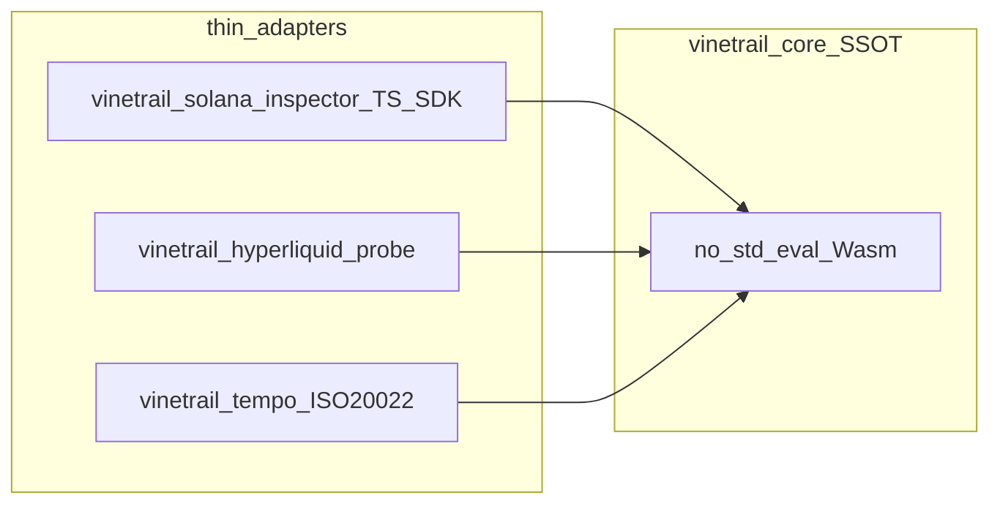

# Multi-Repo 运维与统一日志 SSOT（Internal）

**内部工程规范 — 不纳入对外产品叙事。** 公开 SSOT：[README.md](../../README.md)、[JUDGE_BRIEF.md](../../JUDGE_BRIEF.md)。战略阶段见 [STRATEGIC_ROADMAP.md](./STRATEGIC_ROADMAP.md)。

**三 SKU 仓名、venue、`vinetrail_core` 元数据：** 机器可读 SSOT 为 [`docs/_snippets/multi-repo-ssot.json`](../_snippets/multi-repo-ssot.json)（文档与 CI 须与其一致；禁止回退 `vinetrail-*` 命名）。

本文定义：**多仓单核（One Core, Three Thin Adapters）** 的依赖与发布规则，以及跨 SVM / Hyperliquid L1 / Tempo EVM 的 **链下审计快照** 与 **可选链上锚定** 标准。

**当前落地：** `vinetrail_core` 源码 SSOT 位于本仓 [`crates/vinetrail_core`](../../crates/vinetrail_core)；独立 upstream 仓与 git submodule 为**目标拓扑**（见 §1.3），尚未从本仓拆出。

---

## 1. Multi-Repo Single Core 哲学

### 1.1 为何 `vinetrail_core` 是域无关的

[`crates/vinetrail_core`](../../crates/vinetrail_core) 使用 `#![no_std]` Rust，仅暴露：

- 固定长度 **lanes** 浮点向量（`SOIL_INPUT_FLOATS` / Wasm ABI）
- **Soil** 评估：`eval_soil` → `trip_flags`（交叉场所、深度、协议等位标志）
- **R17/R20** 断路器：`eval_r17_r20` → `defense_bits`
- 统一入口：`check_soil_resistance` → `SoilVerdict { allowed, soil, circuit }`

不链接 Solana SDK、不解析 EVM calldata、不依赖 Hyperliquid 节点类型。各链 **Thin Adapter** 只做：

1. 链上/链下探测（交易、订单、ISO 20022 字段）
2. 映射为 Wasm lanes（例如 Solana 见 [`solana-soil-lanes.ts`](../../src/core/solana-soil-lanes.ts)）
3. 调用同一 `vinetrail_core_eval` / TS Wasm 封装

因此同一 Wasm 引擎可服务：

| 运行时 | 代表 SKU 仓 | Adapter 职责 |
|--------|-------------|--------------|
| **SVM** | `vinetrail-Solana` | `VersionedTransaction` / Jito bundle 预检（[`wire.rs`](../../crates/vinetrail_solana_inspector/src/wire.rs)） |
| **Hyperliquid L1 AppChain** | `vinetrail-hyperliquid`（规划） | L2 订单意图 → lanes；**非**通用 EVM 全节点解析 |
| **EVM / Tempo** | `vinetrail-tempo`（规划） | Calldata + ISO 20022 Memo 轨 → lanes |

### 1.2 One Core, Three Thin Adapters



**禁止**在三个 SKU 仓内各维护一份 `vinetrail_core` 拷贝；差异只允许出现在 adapter 与 CI 夹具中。

### 1.3 Git Submodule 与版本防漂移

| 规则 | 说明 |
|------|------|
| **单一发布源** | `vinetrail_core` 仅在一个 upstream 仓打 tag（例：`soil-core-v1.x.y`） |
| **消费方式** | 各适配器仓：`git submodule` 指向固定 commit，或 Cargo `[path]` + lockfile 记录 SHA |
| **CI 门禁** | PR 若 bump submodule 指针，必须跑 Rust `soil_eval` parity + 各仓 Wasm/TS 金样例 |
| **ABI 同步** | tag bump 时同步 [`WASM_ABI_VERSION`](../../crates/vinetrail_core/src/eval.rs) 与本文件附录版本表 |
| **发布顺序** | core tag → `vinetrail-Solana` / `vinetrail-hyperliquid` / `vinetrail-tempo` 依次 bump 指针 → 内部 changelog |

**Checklist（发布前）：**

- [ ] submodule SHA 与 tag 一致
- [ ] `WASM_ABI_VERSION` 三仓一致
- [ ] `RiskAuditSnapshot` 字段与 `SoilVerdict` 仍对齐（§2）
- [ ] 公开基准文档未夸大 adapter 能力（见 [COLLOSSEUM_QA.md](../submission/COLLOSSEUM_QA.md)）

---

## 2. 统一日志与审计轨迹

### 2.1 链下实时快照：`RiskAuditSnapshot`

每次 pre-broadcast / pre-submit 评估后，**异步**写入链下日志或 KV；**不阻塞** guard 热路径。

TypeScript 类型 SSOT：[`src/core/risk-audit-snapshot.ts`](../../src/core/risk-audit-snapshot.ts)（与 Rust `vinetrail_core` 位标志 parity）。

| 字段 | 类型 | 含义 |
|------|------|------|
| `timestamp` | string | ISO-8601 UTC |
| `venue` | `"solana"` \| `"hyperliquid"` \| `"tempo"` | 执行场所 |
| `inputDigest` | string | 规范化输入的 SHA-256（小写 hex，64 字符） |
| `soilResult` | object | `allowed`、`tripFlags`、`defenseBits` |
| `r17Flags` | object | `tripped` + `bit`（`65536` = `1 << 16`） |
| `r20Flags` | object | `tripped` + `bit`（`524288` = `1 << 19`） |
| `executionLatencyNs` | number | 单次评估墙钟纳秒 |

**`soilResult.tripFlags`（与 Rust 一致）：**

| 位 | 常量 | 值 |
|----|------|-----|
| 交叉场所 | `TRIP_CROSS_VENUE` | 1 |
| 深度 | `TRIP_DEPTH` | 2 |
| 不足/经济 | `TRIP_INSUFFICIENT` | 4 |
| 协议 | `TRIP_PROTOCOL` | 8 |

**`inputDigest` 规范化（canonical）：**

1. 构建对象 `canonicalInput`：`{ venue, wasmAbiVersion, lanes: number[] }`，`lanes` 为评估时传入 core 的完整 float 数组（固定长度）。
2. JSON 序列化：**键按字母序**、`lanes` 内数值用 JSON number（无多余字段）。
3. UTF-8 编码后 SHA-256；输出 hex。**实现应使用零分配或预分配 buffer**（Rust `sha2`；TS `@noble/hashes` 或 `crypto.subtle`）。

可选扩展字段（非 SSOT 必填）：`anchor`（§2.2）、`telemetry`（Jito endpoint、slot 等）。

#### 示例 A — Solana Jito bundle guard **通过**

```json
{
  "timestamp": "2026-09-26T04:12:33.891Z",
  "venue": "solana",
  "inputDigest": "a3f2c8910e4b5d6c7a8b9c0d1e2f3a4b5c6d7e8f9a0b1c2d3e4f5a6b7c8d9e0",
  "soilResult": {
    "allowed": true,
    "tripFlags": 0,
    "defenseBits": 0
  },
  "r17Flags": { "tripped": false, "bit": 65536 },
  "r20Flags": { "tripped": false, "bit": 524288 },
  "executionLatencyNs": 84200,
  "telemetry": {
    "jitoEndpoint": "https://mainnet.block-engine.jito.wtf",
    "bundleTxCount": 2
  }
}
```

#### 示例 B — Solana **拒绝**（土壤 trip + R20）

```json
{
  "timestamp": "2026-09-26T04:12:34.102Z",
  "venue": "solana",
  "inputDigest": "7b8c9d0e1f2a3b4c5d6e7f8a9b0c1d2e3f4a5b6c7d8e9f0a1b2c3d4e5f6a7b8",
  "soilResult": {
    "allowed": false,
    "tripFlags": 2,
    "defenseBits": 524288
  },
  "r17Flags": { "tripped": false, "bit": 65536 },
  "r20Flags": { "tripped": true, "bit": 524288 },
  "executionLatencyNs": 91500
}
```

### 2.2 链上锚定策略（可选）

默认路径：**0-gas 链下评估** + 链下 `RiskAuditSnapshot` 全量留存。链上仅作 **审计锚点**，非热路径必需。

| Venue | 锚定方式 | 与 `inputDigest` |
|-------|----------|------------------|
| **Solana** | Jito / RPC **telemetry**（endpoint、slot、bundle 元数据）；可选 **SPL Memo**：`SG-AUDIT:<first16ofDigest>` | Memo 存 digest 前 16 hex；全量在链下 |
| **Hyperliquid** | EIP-712 订单 **`cloid`** 或 client metadata 嵌入 digest 截断/hash | 订单复盘：`cloid` → 链下 SSOT |
| **Tempo** | ISO 20022 Memo：`/ACC/SG/<sha256_digest>` | 与支付备注字段一致，全 digest |

---

## 3. Judge FAQ 与架构完整性

### Q1：单一 Wasm 引擎如何同时安全处理 EVM 与 SVM？

**答：** Wasm 层 **不解析** 任一条链的交易格式。安全边界在 adapter：

- **SVM**：仅 adapter 将 `VersionedTransaction` 解码为探测摘要与 lanes；畸形交易在 adapter 层拒绝，不进入 `vinetrail_core_eval`。
- **EVM/Tempo**：adapter 解析 calldata / ISO 20022 字段后填 lanes；链别混淆（例如把 Solana bytes 送入 EVM adapter）由类型与 venue 字段隔离。

Core 只做 **确定性数值与位标志**（与 [COLLOSSEUM_QA](../submission/COLLOSSEUM_QA.md) 中「inspector 边界」叙述一致）。无共享可变链状态、无跨链重入。

### Q2：统一日志的性能开销是多少？

**答：**

- **热路径**：`check_soil_resistance` / Rust `bench_eval` 为亚毫秒级；TS `pnpm run bench:guard` 含序列化与多 tx 路径，数值见 [BENCHMARK.md](../submission/BENCHMARK.md)（勿与纯 Rust bench 混读）。
- **`inputDigest`**：规范要求 **零分配 hash**；不得在 guard 循环内 `JSON.stringify` 大对象阻塞发送——应先完成 allow/deny，再异步 canonical + hash。
- **审计 JSON**：异步刷写（队列 / Worker / Edge KV），**0-gas**；链上 Memo/cloid 仅在有合规或机构需求时附加。

---

## 附录：文档版本

| 版本 | 日期 | 说明 |
|------|------|------|
| 1.0 | 2026-09-26 | 初版：多仓 SSOT + `RiskAuditSnapshot` + 三链锚定 + Judge FAQ |
| 1.1 | 2026-09-26 | Hyperliquid SKU 统一命名；绑定 `multi-repo-ssot.json` |
| 1.2 | 2026-09-26 | GitHub `vinetrail` 组织 + `vinetrail_core` Wasm；三仓 `vinetrail-Solana` / `vinetrail-hyperliquid` / `vinetrail-tempo` |
